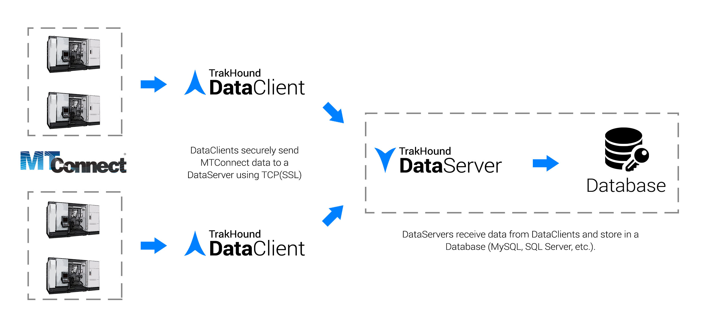

<br>
<br>
TrakHound DataClient reads MTConnect® streams and sends the data to TrakHound DataServers to be stored. 

TrakHound DataClient and DataServer are designed specifically to store MTConnect® data in a database. Nearly all MTConnect data is stored with its original terminology in database tables for data storage or to use with cloud applications. 



# TrakHound
The TrakHound DataClient and DataServer applications provide the manufacturing community with a Free and Open Source alternative so anyone can start collecting valuable machine data that can be used to analyze and improve future production in the upcoming years that will dominated by the IIoT. TrakHound provides you the tools to collect MTConnect data in near raw form and to store that data for later use. Even if you don't see the need for this data now, you may in several years and will wish you had previous year's data to compare. **Take the steps today to prepare for tomorrow and get started with IIoT with TrakHound!**

# Features
- Automatically finds and configures MTConnect devices on a network
- Data filtering with triggers to collect all data or only what is needed
- Ability to send data to multiple TrakHound DataServers to create data redundancy or to meet data security requirements (local vs cloud)
- Utitlizes streaming connections for both MTConnect and connections to TrakHound DataServers
- Supports SSL(TLS) for sending data to TrakHound DataServers
- Non-volatile buffering to retain collected data between connection interruptions


### Data Storage
**MTConnect Agents by themselves are not storage applications.** This is made clear in the MTConnect Standard. Instead the purpose of MTConnect Agents is to serve data to client applications when requested. While the Agent does keep a small buffer, this buffer is not intended to be used for data storage but rather to retain data between connection interruptions. TrakHound fulfills the role of requesting this data and then storing it in a database for permanant storage. Data is stored which can then be accessed by other TrakHound applications, ERP/MES systems, third party software, or by reading the database directly using software such as Microsoft Access.

### Cloud Applications
Although the MTConnect Agent is a server application itself, most situations require Incoming connections where the application accesses the Agent directly which requires firewall exceptions and since many Agents run on the machine contol itself this would mean each machine would need to accessible from outside networks (usually undesirable for security reasons). TrakHound solves this issue by centralizing the data onto a single server which can either be accessed using the TrakHound API over HTTP/HTTPS or directly to the database itself. Since all of the MTConnect data is now **Outgoing** as opposed to Incoming, machine controls can stay isolated from external networks while a single DataServer accepts incoming requests.

### Security
One of the main goals of TrakHound is to provide tools to securely collect data so that no matter what restrictions your industry requires, you can still benefit from data analysis to improve your manufacturing processes. TrakHound fully supports SSL(TLS) encrypted connections for the DataClient -> DataServer connections as well as the API access. When used with a trusted SSL Certificate, data is sent securely just as online banking/payments are sent. 

By centralizing the point where data is accessed, TrakHound also allows internal machine networks to stay isolated from external networks to prevent both unauthorized data access and possible viruses from effecting the machine controls themselves.

Each TrakHound DataClient can also filter data to only send specific data to certain DataServers. This can be used to only send status data to a cloud server used for machine status monitoring, while sending ALL data to a secure onsite server. 


# Configuration
Configuration is read from the **client.conf** XML file in the following format:

```xml
<?xml version="1.0" encoding="utf-8" ?>
<DataClient>

  <!--List of configured MTConnect Devices to read from-->
  <Devices>
    <Device deviceId="1234" deviceName="VMC-3Axis">http://agent.mtconnect.org</Device>
  </Devices>

  <!--Configuration for finding MTConnect Devices on the network-->
  <DeviceFinder scanInterval="5000">
    
    <!--Specify Port Range-->
    <Ports minimum="5000" maximum="5020"/>

    <!--Specify Address Range-->
    <Addresses minimum="192.168.1.100" maximum="192.168.1.120"/>
    
  </DeviceFinder>
    
  <!--Configuration for sending data to TrakHound DataServers-->
  <DataServers>
    <DataServer hostname="192.168.1.15" useSSL="true">
      
      <!--Data Buffer Directory to buffer failed transfers until sent successfully-->
      <Buffer>c:\TrakHound\Buffers\</Buffer>
      
      <!--Define the data to send to DataServer-->
      <DataGroups>

        <!--Collect all data-->
        <DataGroup name="all" captureMode="ACTIVE">
          <Allow>
            <Filter>*</Filter>
          </Allow>
        </DataGroup>

      </DataGroups>

    </DataServer>
    
  </DataServers>
  
</DataClient>
```

## Devices 
List of configured MTConnect Devices to read from.

```xml
 <Devices>
    <Device deviceId="1234" deviceName="VMC-3Axis">http://agent.mtconnect.org</Device>
    <Device deviceId="TY3FNQCZKM3R2V0WWI9H3AUISLW" deviceName="Haas_Device">http://192.168.1.198:5000</Device>
    <Device deviceId="KGI13AOQSUERHF1XVQSFWLDIBS" deviceName="OKUMA.Lathe">http://192.168.1.198:5001</Device>
    <Device deviceId="RVJGKEA9ZXUPUIGFVMTQP98L0UY" deviceName="OKUMA.Lathe">http://192.168.1.198:5006</Device>
    <Device deviceId="UPSFKO6IBDAEOPSFEHLGAIMLCM" deviceName="OKUMA.MachiningCenter">http://192.168.1.198:5003</Device>
    <Device deviceId="UXJGZKSQS9DIEY7JQ912RS7Q4" deviceName="OKUMA.Grinder">http://192.168.1.198:5002</Device>
  </Devices>
  ```

#### Device ID 
###### *(XmlAttribute : deviceId)*
The globally unique identifier for the device. When detected automatically, the Device ID is a hash of the device's DeviceName, port, and MAC address. The MAC address is used so that MTConnect Agents can use DHCP while still being identified as the same device.

#### Device Name
###### *(XmlAttribute : deviceName)*
The DeviceName of the MTConnect Device to read from

#### Address
###### *(XmlText)*
The base Url of the MTConnect Agent. Do not specify the Device Name in the url, instead specify it under the deviceName attribute.

## DeviceFinder 
Configuration for finding MTConnect Devices on the network. *If omitted, the network will not be scanned and no devices will be automatically found or configured.*

```xml
 <DeviceFinder scanInterval="5000">
    
    <!--Specify Port Range-->
    <Ports minimum="5000" maximum="5020">
      <Allow>
        <Port>5120</Port>
      </Allow>
      <Deny>
        <Port>5002</Port>
        <Port>5003</Port>
        <Port>5007</Port> 
      </Deny>
    </Ports>

    <!--Specify Address Range-->    
    <Addresses minimum="192.168.1.100" maximum="192.168.1.120">
      <Allow>
        <Address>192.168.1.198</Address>    
      </Allow>
      <Deny>
        <Address>192.168.1.110</Address>
        <Address>192.168.1.102</Address>  
      </Deny>
    </Addresses>
    
  </DeviceFinder>
  ```
  
#### Scan Interval 
###### *(XmlAttribute : scanInterval)*
The interval (in milliseconds) at which the network will be scanned for new devices. *If omitted, the network will only be scanned when the DataClient is initially started.*
  
### Ports
Used to filter the ports to scan. *If omitted, the default port range of 5000 - 5010 will be used.*

#### Minimum 
###### *(XmlAttribute : minimum)*
The minimum in the range of ports to search

#### Maximum 
###### *(XmlAttribute : maximum)*
The maximum in the range of ports to search

#### Allow
List of Ports that are specifically allowed to be searched. *Allowed ports override the range and denied ports.*

#### Denied
List of Ports that are specically denied and not allowed to be searched.

### Addresses
Used to filter the IP addresses to scan. *If omitted, all reachable IP addresses within the subnet will be scanned.*

#### Minimum 
###### *(XmlAttribute : minimum)*
The minimum in the range of addresses to search

#### Maximum 
###### *(XmlAttribute : maximum)*
The maximum in the range of addresses to search

#### Allow
List of Addresses that are specifically allowed to be searched. *Allowed addresses override the range and denied addresses.*

#### Denied
List of Addresses that are specically denied and not allowed to be searched.


## DataServers
Represents each TrakHound Data Server that data is sent to in order to be strored.

```xml
<DataServers>
    <DataServer hostname="192.168.1.15" port="8472" useSSL="true">
      
      <!--Data Buffer Directory to buffer failed transfers until sent successfully-->
      <Buffer>c:\TrakHound\Buffers\</Buffer>
      
      <!--Define the data to send to DataServer-->
      <DataGroups>

        <!--Collect ALL Data-->
        <DataGroup name="all" captureMode="ACTIVE">
          <Allow>
            <Filter>*</Filter>
          </Allow>
        </DataGroup>

      </DataGroups>

    </DataServer>
    
  </DataServers>
```

#### Hostname 
###### *(XmlAttribute : hostname)*
The hostname of the TrakHound Data Server to send data to

#### Port 
###### *(XmlAttribute : port)*
The port to send data to the TrakHound Data Server on. *If omitted, the default 8472 will be used.*

#### Use SSL (Secure Socket Layer) 
###### *(XmlAttribute : useSSL)*
The hostname of the TrakHound Data Server to send data to. *If omitted, the default of False will be used.*


### Buffer
Data Buffer Directory to buffer failed transfers until sent successfully. *If omitted, no buffer will be used and may result in "lost" data.*


### DataGroups
DataGroups allow configuration for what data is captured and sent to the DataServer. Data is filtered by Type or by their parent container type. DataGroups can include a list for allowed types as well as for denied types. A CaptureMode can also be defined to configure when the data in the DataGroup is sent.
<br><br>
**NOTE: The use of DataGroups to filter the amount of constantly changing data is highly recommended for most applications as database size can quickly become very large (>1,000,000 records within a few hours for a single device). The "snapshot" technique is the recommended method for most applications. This will help keep your IT guy happy!**
<br><br>

```xml
<DataGroups>
    <!--Collect ALL Data-->
    <DataGroup name="all" captureMode="ACTIVE">
        <Allow>
        <Filter>*</Filter>
        </Allow>
    </DataGroup>
</DataGroups>
```

#### Name
The identifier for the DataGroup. This is primarily used when the DataGroup is being included in another group.

#### CaptureMode
The mode in when data is captured.
  - ACTIVE : Always capture and send data defined in the DataGroup
  - PASSIVE : Only capture and send when included in another DataGroup. This can be used for constantly changing data such as Axis Position to reduce the amount of data stored in the DataServer's database.
  
#### Allow
A list of Types and Ids to capture. This can also include container paths with the wildcard character (*) to allow any types or ids within the container.

- ID : DataItem/Component/Device Id to allow (case sensitive)
- TYPE : DataItem/Component/Device Type to allow. Can be in the format of "PATH_FEEDRATE" or "PathFeedrate".

#### Deny
A list of Types to not capture. This overrides any allowed types.

#### Include
A list of other DataGroups to include when capturing for the current DataGroup. For example, this can be used to capture position data only when another group changes in order to reduce the amount of data stored in the DataServer's database.

#### Filter
Filters specify the path to either allow or deny. Below are examples of accecptable syntax:

- ***** (All types/ids)

- **EmergencyStop** (Any DataItem with the type of EMERGENCY_STOP) *Note: either format can be used "EmergencyStop" or "EMERGENCY_STOP"

- **cn2** (Only the DataItem with the ID of "cn2")

- **Controller/*** (All types/ids WITHIN any component of type Controller)

- **Controller/Path/*** (All types/ids WITHIN any component of type Path that is also within a Controller component)

- **Controller/Path/cn3** (Only the DataItem with the ID of "cn3" that is within Path component that is also within a Controller component)

- **c1/*** (All types/ids WITHIN the component with the ID of "c1")

#### Examples

##### Example 1 (The "snapshot" technique)
Watch for when new "Status" data items are received within a Controller component that isn't listed under the Deny list. DataItems are denied that change constantly such as the current program line/block, feedrate, etc. When a new item is found, include the DataGroup "all". This essentially takes a snapshot of the entire device whenever one of the "Status" items is changed. 

```xml
<!--All Data Items-->
<DataGroup name="all" captureMode="PASSIVE">
    <Allow>
    <Filter>*</Filter>
    </Allow>
</DataGroup>

<!--Device Status Data Group. Always send new data.-->
<DataGroup name="status" captureMode="ACTIVE">
    
    <!--List the allowed Filters-->
    <Allow>
        <Filter>Controller/*</Filter>       
    </Allow>
    
    <!--List the Denied Filters (Denied Filters override Allowed)-->
    <Deny>
        <Filter>Frt</Filter>
        <Filter>PathFeedrate</Filter>
        <Filter>PathPosition</Filter>
        <Filter>Line</Filter>
        <Filter>Block</Filter>
    </Deny>

    <!--List the additional groups to include when current group is captured-->
    <Include>
        <DataGroup>all</DataGroup>
    </Include>
    
</DataGroup>
```

##### Example 2
Only collect data for a single DataItem with the type of "EXECUTION".

```xml
<DataGroup name="execution" captureMode="ACTIVE">
    <Allow>
       <Filter>EXECUTION</Filter>
    </Allow>
</DataGroup>
```

##### Example 3
Only collect axis data.

```xml
<DataGroup name="axes" captureMode="ACTIVE">
    <Allow>
       <Filter>Axes/*</Filter>
    </Allow>
</DataGroup>
```

##### Example 4
Only collect data when the DataItem of type EMEGENCY_STOP is changed. 

```xml
<DataGroup name="all" captureMode="PASSIVE">
    <Allow>
       <Filter>*</Filter>
    </Allow>
</DataGroup>

<DataGroup name="estop" captureMode="ACTIVE">
    <Allow>
        <Filter>EmergencyStop</Filter>       
    </Allow>
    <Include>
        <DataGroup>all</DataGroup>
    </Include>
</DataGroup>
```
